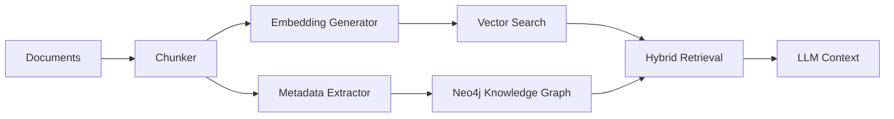

## The Ceiling of Vector-Only RAG

I recently explored an excellent breakdown by [Towards AI](https://pub.towardsai.net/how-i-rebuilt-a-rag-system-that-actually-works-2c5b78437e71) on rebuilding RAG systems for production. It's a solid foundation—fixing chunking strategies, adding hybrid retrieval, implementing rerankers.

But in my academic research as a PostDoc, I realized something: **optimizing vector search has a ceiling**.

Vectors are great for finding similarity, but they struggle with **connectivity**.

<!--more-->

## The Missing Piece: Relationships

The problem with pure vector retrieval is fundamental:

| Vector-Only RAG | What You Actually Need |
|----------------|----------------------|
| "Text similar to my query" | "How concepts connect" |
| Flat similarity scores | Multi-hop reasoning |
| Document-level retrieval | Entity-level relationships |
| Probabilistic matching | Structured, explicit truths |

When I ask about "how FL privacy mechanisms relate to KG-LLM convergence," a vector search finds relevant chunks. But it doesn't understand that:
- Paper A **cites** Paper B
- Method X **inspired** Method Y
- Author Z **collaborated with** Author W
- Concept P **is a type of** Concept Q

## Enter GraphRAG

Instead of relying solely on embeddings, I architected a **GraphRAG** approach:



By introducing a Knowledge Graph alongside the Vector DB, the system doesn't just retrieve "related text"—it **understands relationships between entities**.

## The Immediate Wins

### 1. Multi-Hop Reasoning ✅

The model can follow a chain of facts across different documents.

**Before (Vector-only):**
```
Query: "How does federated learning impact privacy in educational settings?"
→ Returns chunks mentioning FL, returns chunks mentioning privacy
→ No connection between the two concepts
```

**After (GraphRAG):**
```
Query: "How does federated learning impact privacy in educational settings?"
→ FL nodes → PRIVACY_ENHANCEMENT edges → EDUCATION domain nodes
→ Returns papers where FL privacy techniques were applied to education
```

### 2. Reduced Hallucinations ✅

The LLM is grounded by **structured, explicit truths**, not just probabilistic similarities.

| Hallucination Type | Vector-Only Risk | GraphRAG Mitigation |
|--------------------|------------------|-------------------|
| Fabricated citations | High (semantic match) | Low (explicit CITATION edges) |
| False connections | High (similarity ≠ causality) | Low (requires explicit relationship) |
| Misattributed concepts | High (probabilistic) | Low (grounded in graph structure) |

### 3. Document Versioning ✅

```cypher
// When I update a paper:
(old:Document)-[:SUPERSEDED_BY]->(new:Document)

// Queries automatically use latest:
MATCH (d:Document)
WHERE NOT (d)-[:SUPERSEDED_BY]->()
RETURN d
```

No more stale embeddings. The graph knows which document is current.

## How ScholarGraph Works

### The Graph Schema

```cypher
// Core relationships
(d:Document)-[:CONTAINS]->(c:Chunk)
(c:Chunk)-[:HAS_EMBEDDING]->(e:Embedding)
(d:Document)-[:DISCUSSES_TOPIC]->(t:Topic)
(d:Document)-[:CITES]->(other:Document)

// Metadata
(d:Document)-[:AUTHORED_BY]->(a:Author)
(d:Document)-[:PUBLISHED_IN]->(v:Venue)
```

### Hybrid Retrieval

```python
# 70% semantic + 30% keyword = better recall
from search import HybridSearch

results = hybrid_search.search(
    query="How does GraphRAG reduce hallucinations?",
    k=10,
    mode="hybrid"
)
```

The graph adds something vector search can't: **contextual proximity**.

## Why This Matters

> **The future of RAG isn't just about bigger vectors—it's about better structure.**

This matters for:

### Academic Research 🎓
- Citation networks and influence tracking
- Concept evolution across time
- Gap analysis: what *hasn't* been studied

### Legal Analysis ⚖️
- Precedent relationships
- Statutory hierarchies
- Case law dependencies

### Education 📚
- Curriculum mapping
- Prerequisite dependencies
- Learning progressions

### Enterprise Knowledge 🏢
- Organizational memory
- Expertise graphs
- Project lineage

## Current Status

| Component | Status |
|-----------|--------|
| Core ingestion | ✅ Complete |
| Vector search | ✅ Complete (Neo4j native) |
| Hybrid retrieval | ✅ Complete (BM25 + Semantic) |
| Topic extraction | ✅ Complete |
| Document versioning | ✅ Complete |
| MCP integration | ✅ Complete (19 tools) |
| Structured chunking | 🔜 Phase 2 |
| Cross-encoder reranking | 🔜 Phase 3 |
| RAG evaluation | 🔜 Phase 4 |

## What's Next

I'm now running experiments to push this further:
- 🔬 **Dynamic ontology mapping** — let the graph evolve
- 🔬 **CEFR-aligned language learning graphs** — pedagogical structure
- 🔬 **Federated learning for distributed knowledge** — privacy-preserving graph updates

The results so far are proving that **structure matters as much as similarity**.

---

## Links

- **Full LinkedIn Article:** [Beyond "Better" Retrieval](https://www.linkedin.com/pulse/beyond-better-retrieval-why-i-added-knowledge-graph-my-kenteris-bvacf/)
- **ScholarGraph on GitHub:** [github.com/mkenteris01-code/ScholarGraph](https://github.com/mkenteris01-code/ScholarGraph)
- **Towards AI Article:** [How I Rebuilt a RAG System](https://pub.towardsai.net/how-i-rebuilt-a-rag-system-that-actually-works-2c5b78437e71)

---

*— Michael Kenteris*
*University of the Aegean*
