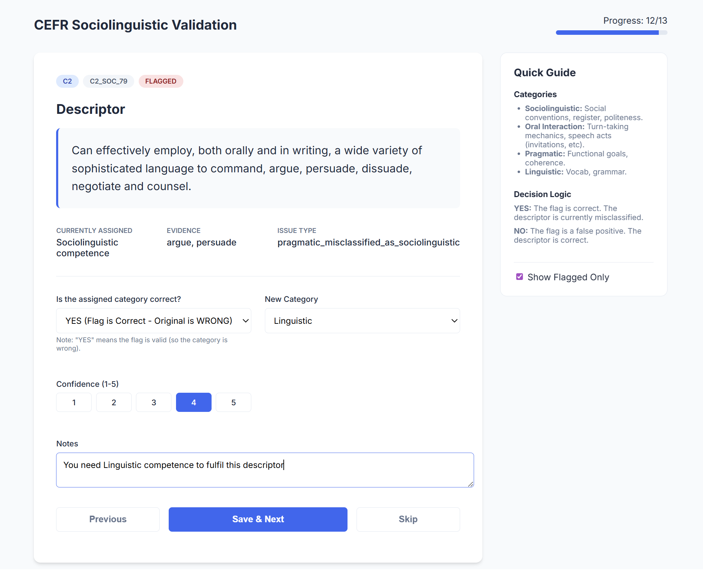

# CEFR Sociolinguistic Validation App

A lightweight web application designed for expert review and validation of CEFR Sociolinguistic Competence descriptors. This tool interfaces directly with a local Excel databank to flag misclassified descriptors.

## 🚀 Features

-   **Excel Database Integration**: Reads and writes directly to `CEFR_Validation_Review_Neo4j.xlsx`.
-   **Review Interface**: Presents flagged descriptors for validation against "Sociolinguistic", "Oral Interaction", "Pragmatic", and "Linguistic" categories.
-   **Validation Workflow**:
    -   Confirm or reject automated flags.
    -   Reclassify descriptors.
    -   Add confidence levels and expert notes.
-   **Modern UI**: Clean, responsive interface built with Flask and Vanilla CSS.
-   **Filtering**: Default view shows only flagged items requiring attention.
-   **Multi-Level Support**: Dynamically loads all CEFR levels (A1, A1+, A2, B1, etc.) from the source Excel file.

## 📸 Screenshot



**The web interface** provides an intuitive review experience with:
- Progress indicator showing completion status
- Descriptor text with original and suggested classifications
- Confidence rating selector (1-5)
- Expert notes field for qualitative feedback
- Navigation controls (Save & Next, Skip, Previous)

## 🛠️ Prerequisites

-   Python 3.8+
-   `pip` package manager

## 📦 Installation

1.  Clone the repository or navigate to the project folder:
    ```bash
    cd c:\projects\AgenticAIpkg\scripts\ce_validation\teacherassessment
    ```

2.  Install the required dependencies:
    ```bash
    pip install -r requirements.txt
    ```

## 🏃 Usage

1.  **Start the Application**:
    ```bash
    python app.py
    ```

2.  **Access the Interface**:
    Open your web browser and navigate to:
    [http://127.0.0.1:5000](http://127.0.0.1:5000)

3.  **Review Descriptors**:
    -   Navigate through the descriptors using **Save & Next** or **Skip**.
    -   Your decisions are saved directly to the Excel file in the `data/` directory.

## 📂 Project Structure

```text
teacherassessment/
├── app.py                 # Flask backend application
├── requirements.txt       # Python dependencies
├── data/
│   ├── CEFR_Validation_Review_Neo4j.xlsx  # Main dataset (Excel)
│   └── EXPERT_REVIEW_GUIDE.md             # Review guidelines
├── static/
│   ├── style.css          # Frontend styling
│   └── script.js          # Frontend logic (API calls, UI updates)
└── templates/
    └── index.html         # Main HTML template
```

## 📝 Notes

-   **Data Safety**: The application uses `openpyxl` to preserve existing Excel formatting and validation rules when saving changes.
-   **Concurrency**: Designed for single-user local use. Close the Excel file in other programs while performing saves to avoid file lock errors.
